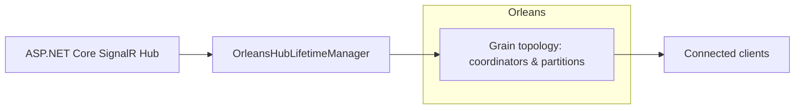
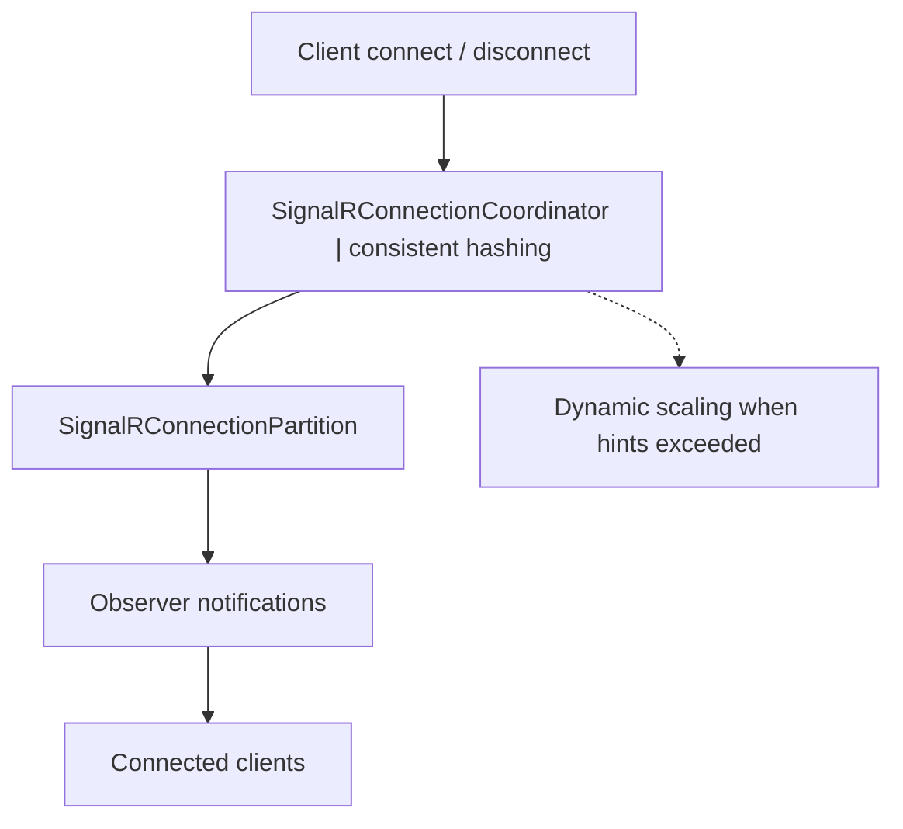
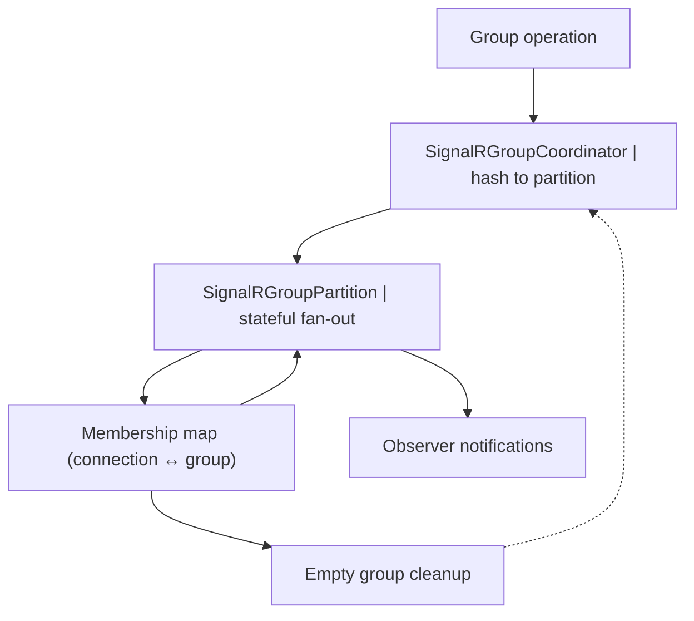

# Orleans.SignalR

Cloud-native SignalR backplane powered by Microsoft Orleans virtual actors. Orleans.SignalR lets you scale ASP.NET Core SignalR hubs horizontally without surrendering real-time guarantees. Connections, groups, and invocations are coordinated and fanned out through Orleans grains, giving you deterministic delivery, automatic resilience, and pluggable persistence.

## Highlights
- Orleans-first SignalR lifetime manager with transparent multi-silo fan-out.
- Connection and group partitioning built on consistent hashing and dynamic scaling hints.
- Full parity with SignalR primitives (`Clients.All`, `Groups.AddToGroupAsync`, user targeting, client invocations, etc.).
- Works with any Orleans persistence provider; ships with memory storage defaults for quick starts.
- Tested under heavy load with automated stress and partitioning suites.

## Packages

| Package | Description |
| --- | --- |
| `ManagedCode.Orleans.SignalR.Core` | Core abstractions, options, helper utilities, hub lifetime manager. |
| `ManagedCode.Orleans.SignalR.Server` | Orleans grains (coordinators, partitions, groups, users, invocations) for silo hosts. |
| `ManagedCode.Orleans.SignalR.Client` | Client extensions to plug Orleans into SignalR with no ceremony. |

## Quick Start

### 1. Install NuGet packages

```powershell
Install-Package ManagedCode.Orleans.SignalR.Server
Install-Package ManagedCode.Orleans.SignalR.Client
```

### 2. Configure your Orleans silo

```csharp
using ManagedCode.Orleans.SignalR.Core.Config;
using ManagedCode.Orleans.SignalR.Server.Extensions;

var builder = Host.CreateApplicationBuilder(args);

builder.Host.UseOrleans(silo =>
{
    silo.ConfigureOrleansSignalR();
    silo.AddOrleansSignalRInMemoryStorage(); // or silo.AddMemoryGrainStorage(OrleansSignalROptions.OrleansSignalRStorage);
});

builder.Services
    .AddSignalR()
    .AddOrleans(options =>
    {
        options.ConnectionPartitionCount = 4;
        options.GroupPartitionCount = 4;
    });
```

> Storage note: all SignalR grains persist their connection/group metadata using the storage provider registered under `OrleansSignalROptions.OrleansSignalRStorage`. The helper `AddOrleansSignalRInMemoryStorage()` wires up the built-in in-memory provider (per the [Orleans grain persistence docs](https://learn.microsoft.com/dotnet/orleans/grains/grain-persistence)) and is the recommended default because connection state churns rapidly. If you prefer to register the provider yourself—either `AddMemoryGrainStorage(OrleansSignalROptions.OrleansSignalRStorage)` or a custom `IGrainStorage` implementation—just make sure it uses the same storage name. Avoid heavyweight databases for this store unless you truly need durability beyond silo restarts.

### 3. Configure your Orleans client

```csharp
var clientBuilder = new ClientBuilder()
    .UseLocalhostClustering()
    .ConfigureServices(services =>
    {
        services
            .AddSignalR()
            .AddOrleans();
    });
```

### 4. Use typed hub context inside grains

```csharp
public class WeatherGrain : Grain, IWeatherGrain
{
    private readonly IOrleansHubContext<WeatherHub, IWeatherClient> _hub;

    public WeatherGrain(IOrleansHubContext<WeatherHub, IWeatherClient> hub) => _hub = hub;

    public Task BroadcastAsync(string forecast)
    {
        return _hub.Clients.All.ReceiveForecast(forecast);
    }
}
```

## Architecture Overview

At the heart of Orleans.SignalR sits `OrleansHubLifetimeManager<THub>`. It replaces the default SignalR lifetime manager and orchestrates fan-out through Orleans grains when hubs interact with connections, groups, and users.

### High-Level Flow



1. The ASP.NET Core hub writes to `OrleansHubLifetimeManager<T>` instead of the default SignalR manager.
2. The lifetime manager resolves the Orleans grains that own connections, groups, users, and invocations.
3. Grains fan messages back to clients by invoking the observers recorded for each connection.

### Connection Fan-Out Pipeline



1. **Connection observed** — the lifetime manager registers an `ISignalRObserver` when a client connects.
2. **Coordinator assignment** — `SignalRConnectionCoordinatorGrain` hashes the connection ID to a partition number.
3. **Partition grain** — `SignalRConnectionPartitionGrain` stores the observer handle and relays messages such as `Clients.All`, `Clients.Client`, or `Clients.User`.
4. **Dynamic scaling** — the coordinator grows the partition ring (powers of two) when `ConnectionsPerPartitionHint` is exceeded and shrinks it when load drops to zero.

### Group Fan-Out Pipeline



1. **Group coordinator** — `SignalRGroupCoordinatorGrain` maintains group membership counts.
2. **Partition assignment** — group names are hashed to `SignalRGroupPartitionGrain` instances using the same power-of-two heuristic (`GroupPartitionCount` plus `GroupsPerPartitionHint`).
3. **Partition state** — partitions keep connection↔group maps so `SendToGroup`, `SendToGroups`, and exclusion variants can enumerate the relevant observers quickly.
4. **Automatic cleanup** — when a group becomes empty the coordinator notifies partitions so they can drop state and resize if necessary.

### Connection, Group, and User Grains

- `SignalRConnectionHolderGrain` and `SignalRGroupGrain` remain as non-partitioned fallbacks when partitioning is disabled (`ConnectionPartitionCount = 1` or `GroupPartitionCount = 1`).
- `SignalRUserGrain` aggregates all connections for a given user identifier and issues fan-out when you target `Clients.User`.
- `SignalRInvocationGrain` handles client-to-server invocation plumbing (`Clients.Client(connectionId).InvokeCoreAsync(...)`), ensuring tasks run off the activation thread.

## Partitioning Strategy

- **Consistent hashing** — connection IDs and group names are hashed onto a ring with virtual nodes (`PartitionHelper`). This keeps existing connections stable when the partition set expands.
- **Dynamic sizing** — coordinators compute the optimal partition count as the next power of two above `expected / hint`, ensuring evenly balanced partitions for millions of connections or groups.
- **Reset semantics** — when no entries remain, coordinators revert to the configured `ConnectionPartitionCount` / `GroupPartitionCount` base, so idle hubs do not hold unnecessary grains.
- **Observer fan-out** — partition grains rely on Orleans `ObserverManager` to multiplex message delivery to every connected client within that partition.

### Placement Strategies

Connection grains (`SignalRConnectionHolderGrain` and `SignalRConnectionPartitionGrain`) use Orleans' default placement strategy by default. If your deployment needs to force a particular placement (for latency or locality reasons) you can:

1. Annotate the grain with the desired built-in placement attribute (e.g., `[PreferLocalPlacement]`, `[RandomPlacement]`, etc.).
2. Register a custom placement strategy in the silo host (`siloBuilder.ConfigureServices(services => services.UseGrainPlacement<MyPlacementStrategy, MyDirector>());`).

See the [Orleans placement docs](https://learn.microsoft.com/dotnet/orleans/grains/placement) for available options and guidance on writing custom policies.

### How Connection Partitioning Works

1. **Hub lifetime manager routing** — when a client connects, `OrleansHubLifetimeManager<THub>` asks the `SignalRConnectionCoordinatorGrain` for a partition id and registers the observer with the corresponding `SignalRConnectionPartitionGrain`. When the client disconnects the lifetime manager removes the observer and notifies the coordinator so the mapping can be cleaned up.
2. **Coordinator bookkeeping** — `SignalRConnectionCoordinatorGrain` keeps a persisted dictionary of connection ids to partition ids. It calls `PartitionHelper.GetPartitionId` to pick a slot, and `EnsurePartitionCapacity` grows the partition ring to the next power of two when tracked connections exceed `ConnectionsPerPartitionHint`. If all connections vanish it resets to the configured `ConnectionPartitionCount` and writes the updated state back to the configured storage provider.
3. **Consistent hash ring** — `PartitionHelper` caches hash rings with 150 virtual nodes per physical partition to spread connections evenly. `GetOptimalPartitionCount` and `GetOptimalGroupPartitionCount` implement the “power of two” heuristic used by both coordinators.
4. **Partition grain fan-out** — each `SignalRConnectionPartitionGrain` persists the connection → observer mapping and uses Orleans `ObserverManager` to broadcast to subscribers, including `SendToPartition`, `SendToPartitionExcept`, and per-connection delivery. On deactivation it clears or writes state based on whether any observers remain.

### Connection Partitions in Depth

- **What they are** — a connection partition is just a regular Orleans grain (`SignalRConnectionPartitionGrain`) whose primary key composes the hub identity with a partition number. `NameHelperGenerator.GetConnectionPartitionGrain` hashes the hub name with `XxHash64` and folds in the partition id to produce a long key, so every hub keeps a deterministic set of partition activations.

- **Where they live** — all connection-level grains (coordinator + partitions) are placed in the `ManagedCode.Orleans.SignalR.Server` assembly. The coordinator grain is keyed by the hub name (`typeof(THub).FullName` cleaned to be storage-safe). Partition grains use the same hub key plus the partition number; Orleans activates them on demand and persists the `ConnectionState` record in the storage provider registered under `OrleansSignalROptions.OrleansSignalRStorage` (use `silo.AddOrleansSignalRInMemoryStorage()` or register your own provider under that name).

- **How connections land there** — when a new client connects, the lifetime manager creates an `ISignalRObserver` subscription and calls `AddConnection` on the chosen partition. The partition stores `connectionId -> observerKey` in persistent state and subscribes the observer with `ObserverManager`, so later broadcasts simply loop through observers and push HubMessage payloads.

- **Scaling behaviour** — the coordinator maintains a dictionary of active connections. Before assigning a partition, it calls `EnsurePartitionCapacity`, which compares the current count against the hint and grows the partition ring to the next power of two if necessary. Existing connections keep their partition id thanks to the dictionary; only newly seen connection ids are distributed across the expanded ring. When the number of tracked connections drops to zero, `_currentPartitionCount` shrinks back to the configured base, so idle hubs stop consuming extra partition activations.

- **Sending messages** — hub calls such as `Clients.All` or `Clients.Client(connectionId)` are routed back through the coordinator. It looks up the partition, resolves the grain key via `NameHelperGenerator`, and invokes `SendToPartition`, `SendToPartitionExcept`, or `SendToConnection`. Each partition grain executes the fan-out on the Orleans scheduler using `ObserverManager.Notify`, ensuring delivery stays responsive even when thousands of clients share a partition.

- **Fallback path** — if you set `ConnectionPartitionCount = 1`, the system bypasses the coordinator entirely and relies on `SignalRConnectionHolderGrain`, which keeps the single connection list without the hash ring. This is useful for small deployments or debugging but sacrifices the horizontal scaling afforded by partitions.

- **Keep-alive orchestration** — when `KeepEachConnectionAlive = true`, `SignalRConnectionHeartbeatGrain` runs an Orleans `RegisterTimer` per connection to call `Ping` on the owning partition/holder. This keeps observer subscriptions warm even if the web host is busy, while `KeepEachConnectionAlive = false` relies purely on application traffic and the configured timeout.

## Configuration

Configure `OrleansSignalROptions` to tune throughput and lifecycle characteristics:

| Option | Default | Description |
| --- | --- | --- |
| `ClientTimeoutInterval` | 00:00:30 | How long a client can remain silent before the server times out the connection. Mirrors SignalR keep-alive. |
| `KeepEachConnectionAlive` | `true` | When enabled, the subscription timer pings partition grains so observers never expire. Disable to reduce ping traffic; connections still register with partitions but Orleans observers remain active indefinitely (cleanup happens only when the host disconnects). |
| `KeepMessageInterval` | 00:01:06 | Persistence window for offline message delivery (grains store messages briefly so reconnecting clients do not miss data). |
| `ConnectionPartitionCount` | `4` | Base number of connection partitions (set to `1` to disable partitioning). |
| `ConnectionsPerPartitionHint` | `10_000` | Target connections per partition; coordinators add partitions when this hint is exceeded. |
| `GroupPartitionCount` | `4` | Base number of group partitions (set to `1` to disable partitioning). |
| `GroupsPerPartitionHint` | `1_000` | Target groups per partition; controls dynamic scaling for group fan-out. |

### Example: custom scaling profile

```csharp
services.AddSignalR()
    .AddOrleans(options =>
    {
        options.ConnectionPartitionCount = 8;      // start with 8 partitions
        options.ConnectionsPerPartitionHint = 5_000;

        options.GroupPartitionCount = 4;
        options.GroupsPerPartitionHint = 500;

        options.ClientTimeoutInterval = TimeSpan.FromMinutes(2);
        options.KeepMessageInterval = TimeSpan.FromMinutes(5);
    });
```

## Working with Hub Context inside Orleans

- Request the `IOrleansHubContext<THub>` or `IOrleansHubContext<THub, TClient>` via DI in any grain.
- You can still inject the classic `IHubContext<THub>` if you prefer manual access to `Clients`, `Groups`, etc.
- Client invocations (`Clients.Client(connectionId).InvokeAsync(...)`) are supported. Run them via `Task.Run` (or another scheduler hop) so the Orleans scheduler is never blocked.

```csharp
public class LiveScoreGrain : Grain, ILiveScoreGrain
{
    private readonly IHubContext<LiveScoreHub> _hub;

    public LiveScoreGrain(IHubContext<LiveScoreHub> hub) => _hub = hub;

    public Task PushScoreAsync(string matchId, ScoreDto score) =>
        _hub.Clients.Group(matchId).SendAsync("ScoreUpdated", score);
}
```

## Running Locally

- Restore and build: `dotnet restore` then `dotnet build -c Debug`
- Execute the full test suite (including partition scaling tests): `dotnet test -c Debug`
- The `ManagedCode.Orleans.SignalR.Tests/TestApp` folder contains a minimal test host you can use as a reference for spinning up a local cluster with SignalR hubs.

## Troubleshooting Tips

- **Stuck messages** — ensure both client and silo share the same `OrleansSignalROptions` setup. Partition counts must match or messages cannot reach the correct grain.
- **Massive fan-out** — when broadcasting to thousands of groups at once, the group coordinator uses fire-and-forget tasks. Monitor logs for any `Failed to send to groups` messages to catch slow partitions.
- **Long-lived idle connections** — consider lowering `KeepEachConnectionAlive` or tweaking `ClientTimeoutInterval` if you run huge numbers of clients that rarely send data.

## Contributing

Bug reports and feature ideas are welcome—open an issue or submit a PR. Before pushing code:

- Run `dotnet build` and `dotnet test -c Debug`
- Ensure `dotnet format` leaves no diffs
- Follow the repo conventions outlined in `Directory.Build.props` (nullable enabled, analyzers, C# 13 style)

## License

Orleans.SignalR is released under the [MIT License](LICENSE).
