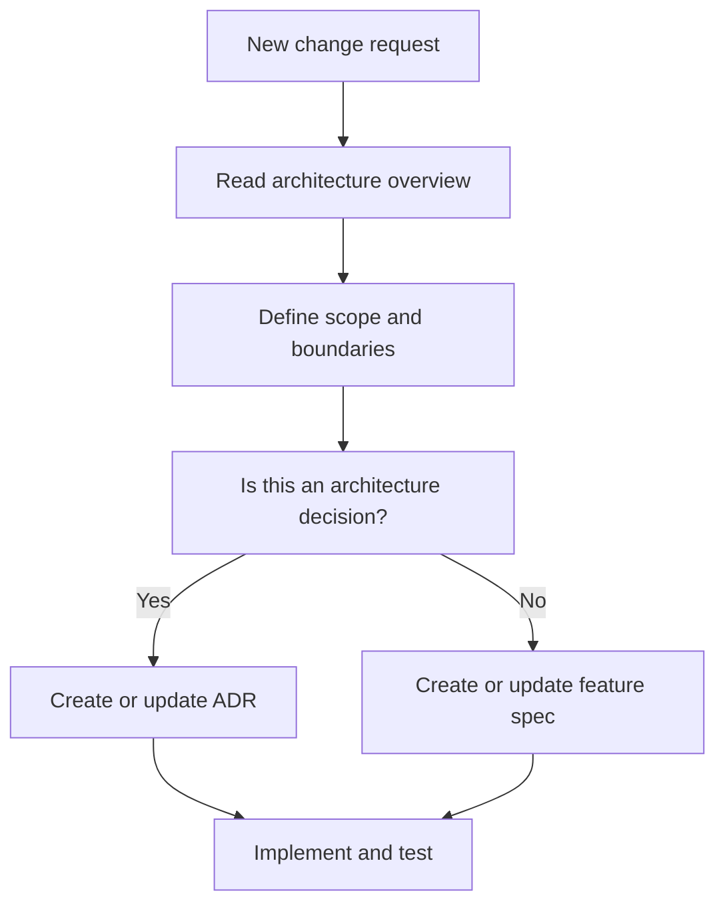

# ADR-0001: Architecture documentation structure and entry point

Date: 2026-01-17
Status: Accepted

## Context

The repository did not have a standard documentation layout under `docs/`, which made it hard to locate architecture boundaries, feature specifications, and decisions. A consistent entry point is required so changes can be scoped before editing code.

## Decision

Adopt a documentation structure with a single architecture entry point and link-based navigation to feature specs and decisions:

- `docs/Architecture/Overview.md` is the primary entry point and contains the module map, boundaries, and dependency rules.
- `docs/Features/*` holds feature specifications and flow diagrams.
- `docs/ADR/*` captures architecture decisions and trade-offs.

## Consequences

- Contributors must start from the architecture overview to scope work.
- Feature behavior and decisions are documented in their dedicated folders rather than the overview.
- Overview diagrams and link indexes must stay aligned with code.

## Decision diagram

## Implementation plan (step-by-step)

- [x] Create `docs/Architecture/`, `docs/Features/`, and `docs/ADR/` folders.
- [x] Add `docs/Architecture/Overview.md` with module map, boundaries, and dependency rules.
- [x] Add an initial feature spec in `docs/Features/` with a Mermaid flow.
- [x] Link the overview to the initial ADR and feature spec.
