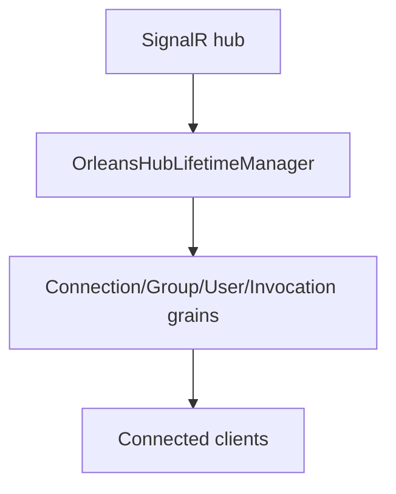

# ADR-0002: Use OrleansHubLifetimeManager for SignalR routing

Date: 2026-01-17
Status: Accepted

## Context

SignalR's default in-memory lifetime manager cannot coordinate connections, groups, and invocations across multiple hosts or silos. This repository needs a single routing mechanism that can fan out hub operations through Orleans grains while keeping the SignalR API surface intact.

## Decision

Provide a custom `OrleansHubLifetimeManager<THub>` and register it via the client integration extension (`AddOrleans`). The lifetime manager routes connection, group, user, and invocation operations through Orleans grains using `IClusterClient` and per-connection `Subscription` tracking.

## Consequences

- ASP.NET Core hosts must register `AddOrleans()` to activate the Orleans backplane.
- Hub operations are translated into grain calls; failures from stale grain directory entries are retried.
- SignalR hubs remain the API surface while Orleans becomes the fan-out and coordination layer.

## Decision diagram

## Implementation plan (step-by-step)

- [x] Register `OrleansHubLifetimeManager<THub>` via `ManagedCode.Orleans.SignalR.Client`.
- [x] Route connection lifecycle and messaging APIs through Orleans grains.
- [x] Track per-connection subscriptions to manage observer updates and cleanup.

## References

- `ManagedCode.Orleans.SignalR.Core/SignalR/OrleansHubLifetimeManager.cs`
- `ManagedCode.Orleans.SignalR.Client/Extensions/OrleansDependencyInjectionExtensions.cs`
- `ManagedCode.Orleans.SignalR.Core/SignalR/Observers/Subscription.cs`
