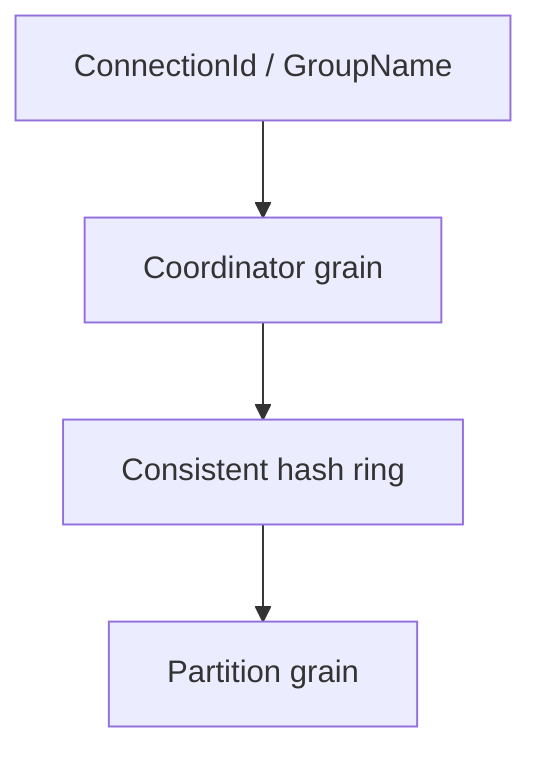

# ADR-0003: Partitioned routing with consistent hashing

Date: 2026-01-17
Status: Accepted

## Context

Connections and groups must scale across many grains while keeping routing stable as partitions grow or shrink. A naive modulo partitioning would reshuffle most keys on resize, creating hot partitions and inconsistent routing.

## Decision

Use consistent hashing with virtual nodes to map connection IDs and group names to partitions. Coordinators persist partition assignments with an epoch to detect stale mappings. Partition counts scale to the next power of two based on connection/group hint thresholds. When the configured partition count is 1, routing falls back to non-partitioned holder/group grains.

## Consequences

- Partition expansion changes only a subset of assignments; existing connections keep their partitions.
- Coordinators must persist partition maps and epoch data to keep routing consistent across restarts.
- Partitioned and non-partitioned paths coexist; configuration decides which is active.

## Decision diagram

## Implementation plan (step-by-step)

- [x] Implement consistent hashing with virtual nodes in `PartitionHelper`.
- [x] Persist partition assignments and epoch data in coordinator grains.
- [x] Route to partition grains when partitioning is enabled; fall back to holder/group grains otherwise.

## References

- `ManagedCode.Orleans.SignalR.Core/Helpers/PartitionHelper.cs`
- `ManagedCode.Orleans.SignalR.Core/Models/PartitionAssignment.cs`
- `ManagedCode.Orleans.SignalR.Server/SignalRConnectionCoordinatorGrain.cs`
- `ManagedCode.Orleans.SignalR.Server/SignalRGroupCoordinatorGrain.cs`
- `ManagedCode.Orleans.SignalR.Server/SignalRConnectionPartitionGrain.cs`
- `ManagedCode.Orleans.SignalR.Server/SignalRGroupPartitionGrain.cs`
- `ManagedCode.Orleans.SignalR.Server/SignalRConnectionHolderGrain.cs`
- `ManagedCode.Orleans.SignalR.Server/SignalRGroupGrain.cs`
