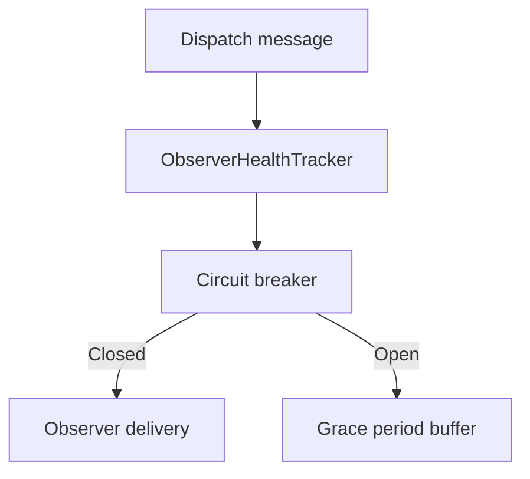

# ADR-0004: Observer health tracking with circuit breaker and grace period

Date: 2026-01-17
Status: Accepted

## Context

Observer delivery failures can cascade across fan-out paths, causing repeated retries, slowdowns, and noisy logs. We need to detect failing observers, limit damage, and allow brief recovery windows without immediately dropping connections.

## Decision

Track observer health per connection using failure windows, circuit breaker state, and optional grace period buffering. A one-way Orleans observer call is only an enqueue operation, so it is never counted as delivery success. The connection host reports an actual SignalR `WriteAsync` failure to every grain registered by that connection and reports recovery after the first subsequent successful write. When a connection exceeds the failure threshold, its circuit opens; messages are skipped or buffered if a grace period is configured. On recovery, buffered messages are replayed and health state is reset.

## Consequences

- Message delivery avoids repeated failures for known-bad observers.
- A small buffer is used during grace periods, trading memory for resilience.
- Behavior is configurable via `OrleansSignalROptions` thresholds and durations.
- One-way observer fan-out stays non-blocking while the rare failure/recovery feedback path reflects the real host-side SignalR write result.

## Decision diagram

## Implementation plan (step-by-step)

- [x] Implement observer health tracking with failure windows and circuit states.
- [x] Add grace period buffering and replay on recovery.
- [x] Integrate health checks into observer dispatch paths.
- [x] Stop treating one-way observer enqueue completion as SignalR delivery success.
- [x] Report real host-side `WriteAsync` failure and first successful recovery back to the sending grain.
- [x] Prove failure threshold, circuit opening, source isolation, and recovery through observer integration tests.

## References

- `ManagedCode.Orleans.SignalR.Core/SignalR/Observers/ObserverHealthTracker.cs`
- `ManagedCode.Orleans.SignalR.Core/SignalR/Observers/ExpiringObserverBuffer.cs`
- `ManagedCode.Orleans.SignalR.Server/SignalRObserverGrainBase.cs`
