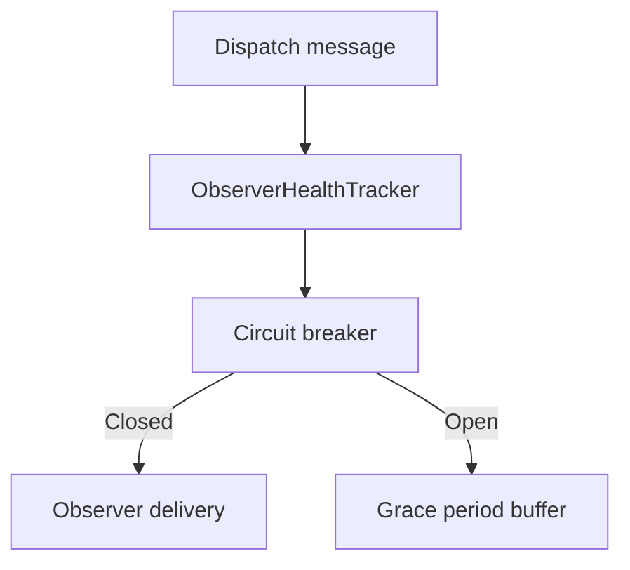

# ADR-0004: Observer health tracking with circuit breaker and grace period

Date: 2026-01-17
Status: Accepted

## Context

Observer delivery failures can cascade across fan-out paths, causing repeated retries, slowdowns, and noisy logs. We need to detect failing observers, limit damage, and allow brief recovery windows without immediately dropping connections.

## Decision

Track observer health per connection using failure windows, circuit breaker state, and optional grace period buffering. When a connection exceeds the failure threshold, its circuit opens; messages are skipped or buffered if a grace period is configured. On recovery, buffered messages are replayed and health state is reset.

## Consequences

- Message delivery avoids repeated failures for known-bad observers.
- A small buffer is used during grace periods, trading memory for resilience.
- Behavior is configurable via `OrleansSignalROptions` thresholds and durations.
- Because observer callbacks are one-way, this mechanism does not constitute an end-to-end SignalR delivery acknowledgement. A separate feedback protocol is required if remote host write failures must drive the circuit state.

## Decision diagram

## Implementation plan (step-by-step)

- [x] Implement observer health tracking with failure windows and circuit states.
- [x] Add grace period buffering and replay on recovery.
- [x] Integrate health checks into observer dispatch paths.

## References

- `ManagedCode.Orleans.SignalR.Core/SignalR/Observers/ObserverHealthTracker.cs`
- `ManagedCode.Orleans.SignalR.Core/SignalR/Observers/ExpiringObserverBuffer.cs`
- `ManagedCode.Orleans.SignalR.Server/SignalRObserverGrainBase.cs`
