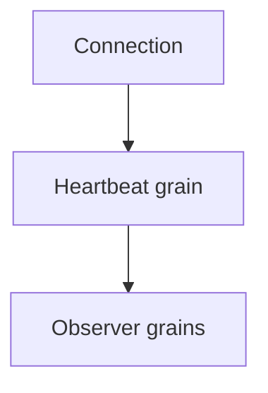

# ADR-0005: Connection heartbeat grain for keep-alive

Date: 2026-01-17
Status: Accepted

## Context

Orleans observer subscriptions can expire when connections are idle, which can drop fan-out delivery for otherwise valid clients. We need an optional mechanism to keep observers alive without relying on application traffic.

## Decision

When `KeepEachConnectionAlive` is enabled, start a dedicated heartbeat grain per connection. The heartbeat grain periodically pings the relevant connection-related grains (partition/holder/user/invocation) to refresh observer subscriptions and maintain liveness. Heartbeat registration is persisted so it can recover after reactivation.

## Consequences

- Additional grains and timers are created when the keep-alive mode is enabled.
- Idle connections remain reachable without application traffic.
- Heartbeat behavior is fully opt-in via configuration.

## Decision diagram

## Implementation plan (step-by-step)

- [x] Create `SignalRConnectionHeartbeatGrain` with persistent registration.
- [x] Register heartbeat from the hub lifetime manager on connect/update.
- [x] Stop and clean up heartbeat on disconnect.

## References

- `ManagedCode.Orleans.SignalR.Server/SignalRConnectionHeartbeatGrain.cs`
- `ManagedCode.Orleans.SignalR.Core/SignalR/OrleansHubLifetimeManager.cs`
- `ManagedCode.Orleans.SignalR.Core/Models/ConnectionHeartbeatRegistration.cs`
