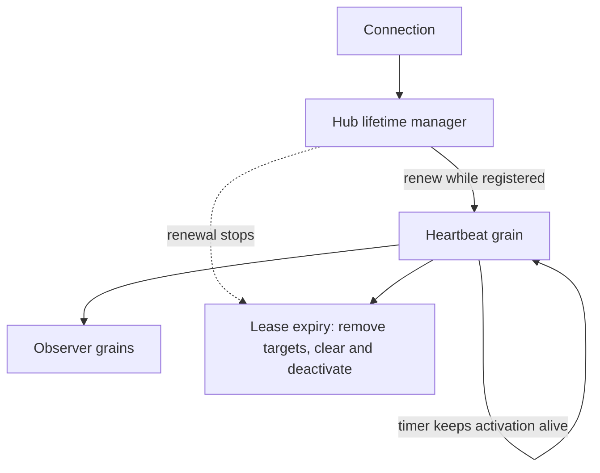

# ADR-0005: Connection heartbeat grain for keep-alive

Date: 2026-01-17
Status: Accepted

## Context

Orleans observer subscriptions can expire when connections are idle, which can drop fan-out delivery for otherwise valid clients. We need an optional mechanism to keep observers alive without relying on application traffic.

## Decision

When `KeepEachConnectionAlive` is enabled, start a dedicated heartbeat grain per connection. While the local SignalR connection remains registered, the hub lifetime manager renews a bounded lease on that grain. The grain periodically refreshes the relevant connection-related grains (partition/holder/user/invocation) and its timer uses `KeepAlive = true`, so activation collection cannot silently stop a valid refresh loop.

An unchanged lease renewal does not rewrite persistent state or reset the timer. If renewals stop for twice the effective client-timeout interval, the heartbeat removes the connection from every registered target grain, removes its partition coordinator mapping, clears its registration, disposes the timer, and deactivates. This makes explicit `Stop` a fast cleanup path rather than the only protection against orphaned activations or routing state.

## Consequences

- Additional grains and timers are created when the keep-alive mode is enabled.
- The host sends one lightweight lease renewal per local connection every half client-timeout interval.
- A failed per-connection renewal is counted and retried on a later tick without aborting renewals for other connections; warning logs are rate-limited to avoid a connection-count log storm.
- Idle connections remain reachable without application traffic.
- Activation collection does not stop an active heartbeat timer.
- A surviving host renewal reactivates a persisted heartbeat after a silo failure.
- A connection or host failure which cannot send `Stop` leaves at most a bounded two-timeout tail while the heartbeat activation's silo remains alive; both the heartbeat activation and its target routing state are then cleaned up.
- Orleans timers are not durable reminders. If the host and the silo holding the heartbeat activation fail together, no activation remains alive, but persisted registration and target state are only self-healed after the heartbeat is activated again. Fully automatic cleanup for that case requires a reminder or durable sweeper and is a separate storage/scalability decision.
- Heartbeat behavior is fully opt-in via configuration.

## Decision diagram

## Implementation plan (step-by-step)

- [x] Create `SignalRConnectionHeartbeatGrain` with persistent registration.
- [x] Register heartbeat from the hub lifetime manager on connect/update.
- [x] Stop and clean up heartbeat on disconnect.
- [x] Keep the timer activation alive while the connection is registered.
- [x] Prove server push after the configured activation collection age without reconnecting SignalR.
- [x] Renew a bounded host lease without repeated state writes.
- [x] Expire and deactivate an unrenewed heartbeat.
- [x] Prove heartbeat and target-routing cleanup after a server-aborted connection and after lease loss.
- [x] Make renewal failure observable without allowing one connection to terminate the renewal loop.

## References

- `ManagedCode.Orleans.SignalR.Server/SignalRConnectionHeartbeatGrain.cs`
- `ManagedCode.Orleans.SignalR.Core/SignalR/OrleansHubLifetimeManager.cs`
- `ManagedCode.Orleans.SignalR.Core/Models/ConnectionHeartbeatRegistration.cs`
