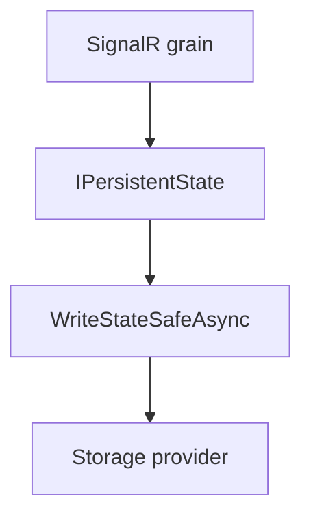

# ADR-0006: Persistent state with shared storage provider and safe writes

Date: 2026-01-17
Status: Accepted

## Context

Connection, group, user, and invocation grains must persist routing state and queued messages. Orleans storage providers can surface ETag conflicts, especially under concurrent updates or when using memory storage in tests. A consistent storage provider name is also required for all SignalR-related grains.

## Decision

Use a single storage provider key (`OrleansSignalROptions.OrleansSignalRStorage`) across all SignalR grains. Implement safe write/clear helpers that retry on `InconsistentStateException` and memory storage ETag mismatch errors. All grain state persistence goes through these helpers when needed.

## Consequences

- State persistence is resilient to transient ETag conflicts.
- Storage provider configuration is centralized and consistent across modules.
- Additional read/write retries add minor overhead during contention.

## Decision diagram

## Implementation plan (step-by-step)

- [x] Define the shared storage provider key in `OrleansSignalROptions`.
- [x] Implement safe write/clear retry helpers for ETag conflicts.
- [x] Use the helpers across connection, group, user, and invocation grains.

## References

- `ManagedCode.Orleans.SignalR.Core/Config/OrleansSignalROptions.cs`
- `ManagedCode.Orleans.SignalR.Server/Helpers/PersistentStateExtensions.cs`
- `ManagedCode.Orleans.SignalR.Server/SignalRConnectionPartitionGrain.cs`
- `ManagedCode.Orleans.SignalR.Server/SignalRGroupPartitionGrain.cs`
- `ManagedCode.Orleans.SignalR.Server/SignalRUserGrain.cs`
- `ManagedCode.Orleans.SignalR.Server/SignalRInvocationGrain.cs`
