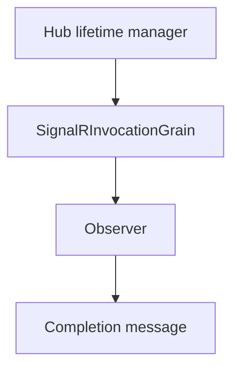

# ADR-0007: Invocation grain for client invocations

Date: 2026-01-17
Status: Accepted

## Context

SignalR client invocations require correlating an invocation ID with a completion message. This state must survive grain reactivation and avoid blocking Orleans activation threads.

## Decision

Use a dedicated `SignalRInvocationGrain` per invocation ID. The grain stores invocation metadata, subscribes observers for completion, and exposes `WaitForCompletion` to await a completion message asynchronously. State is persisted and cleared on completion or deactivation.

The cross-host invocation carries its expected return type in a reserved internal header. The connection host removes the header and caches the type before writing to SignalR, so SignalR's synchronous `TryGetReturnType` hook never waits on Orleans. The completion call into `SignalRInvocationGrain` is acknowledged because it is required to unblock the request; observer delivery remains one-way, and SignalR work remains off the Orleans scheduler.

## Consequences

- Each invocation becomes a short-lived grain activation.
- Completion delivery is isolated per invocation, simplifying correlation.
- Invocation state survives transient activation changes.
- Required completion delivery is not best-effort; failures propagate instead of silently leaving the caller blocked.
- Return-type lookup is an in-memory hot-path operation on the connection host.

## Decision diagram

## Implementation plan (step-by-step)

- [x] Implement `SignalRInvocationGrain` with observer tracking and completion handling.
- [x] Persist invocation info and clear it on completion.
- [x] Expose `WaitForCompletion` for async completion flow.
- [x] Remove synchronous cross-host return-type lookups from the SignalR hot path.
- [x] Keep invocation completion reliable without running SignalR work on the Orleans scheduler.
- [x] Verify the decision with a concurrent cross-host load test.

## References

- `ManagedCode.Orleans.SignalR.Server/SignalRInvocationGrain.cs`
- `ManagedCode.Orleans.SignalR.Core/Interfaces/ISignalRInvocationGrain.cs`
- `ManagedCode.Orleans.SignalR.Core/Models/InvocationInfo.cs`
