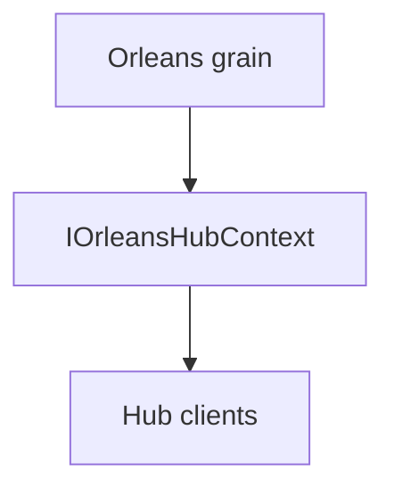

# ADR-0008: Typed Orleans hub context for grains

Date: 2026-01-17
Status: Accepted

## Context

Grains need a clean way to call SignalR clients and manage groups. Using the raw `IHubContext` interface loses compile-time safety for typed client contracts.

## Decision

Expose a typed hub context abstraction `IOrleansHubContext<THub, TClient>` that surfaces `IHubClients<TClient>` and `IGroupManager` to Orleans grains. This keeps the calling surface typed while still routing through the Orleans-aware lifetime manager.

## Consequences

- Grain code gains a strongly-typed client API.
- The abstraction is thin and stays aligned with SignalR primitives.
- Consumers still rely on the same Orleans backplane underneath.

## Decision diagram

## Implementation plan (step-by-step)

- [x] Define typed hub context interfaces in Core.
- [x] Implement hub context and clients wrappers.
- [x] Use the abstraction in grains where typed client calls are needed.

## References

- `ManagedCode.Orleans.SignalR.Core/HubContext/IOrleansHubContext.cs`
- `ManagedCode.Orleans.SignalR.Core/HubContext/OrleansHubContext.cs`
- `ManagedCode.Orleans.SignalR.Core/HubContext/OrleansHubClients.cs`
