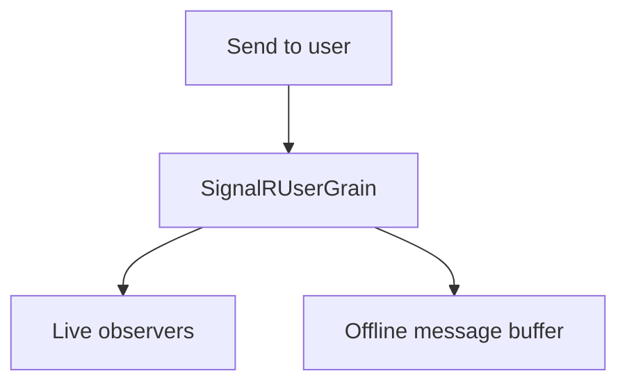

# ADR-0009: User fan-out with offline buffering

Date: 2026-01-17
Status: Accepted

## Context

User-targeted messages must reach all active connections for a user and provide a short buffering window when no live observers are available. Without buffering, brief disconnects could drop messages.

## Decision

Use `SignalRUserGrain` to track all connections for a user. When observers are live, messages are sent immediately. When no observers are available, messages are queued in persistent state with an expiration window and a maximum queue length. On reconnect, the user grain delivers buffered messages via `RequestMessage`.

## Consequences

- User fan-out is centralized per user ID.
- Buffered delivery reduces message loss during short disconnects.
- The queue is bounded; older messages are dropped when limits are exceeded.

## Decision diagram

## Implementation plan (step-by-step)

- [x] Track user connections and observers in `SignalRUserGrain`.
- [x] Buffer messages when no observers are present with expiration metadata.
- [x] Deliver buffered messages on reconnect via `RequestMessage`.

## References

- `ManagedCode.Orleans.SignalR.Server/SignalRUserGrain.cs`
- `ManagedCode.Orleans.SignalR.Core/Models/HubMessageState.cs`
- `ManagedCode.Orleans.SignalR.Core/Config/OrleansSignalROptions.cs`
