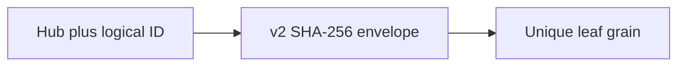

# ADR-0010: Versioned collision-resistant grain key encoding

Date: 2026-09-03
Status: Accepted

## Context

`NameHelperGenerator.CleanString` replaces every unsupported character with `:`, so distinct logical IDs such as `a/b` and `a?b` resolve to the same Orleans grain. That can mix user messages, group membership, invocation state, or heartbeat state across identities. Existing legacy keys are also ambiguous: an `a:b` state record does not prove which original ID created it.

## Decision

Use one versioned, fixed-length `v2:` SHA-256 envelope for every leaf-grain identity containing hub plus user, group, invocation, or connection data. Hub-only coordinator keys remain unchanged.

This is an intentional breaking state/key change for the new major library version. There is no dual read, legacy payload field, or automatic migration path: all new traffic uses only v2 leaf keys and the new state schemas.

## Consequences

- Distinct logical IDs do not share a new grain key, including delimiter and Unicode inputs.
- V2 keys have fixed bounded length and contain only printable storage-safe characters.
- Previous-major leaf-grain state is intentionally not read.

## Decision diagram

## Implementation plan (step-by-step)

- [x] Add deterministic v2 tuple hashing and collision regression tests.
- [x] Route user, group, invocation, and heartbeat leaf identities through v2 while keeping hub coordinators stable.
- [x] Keep the implementation free of legacy key/state compatibility branches.

## References

- `ManagedCode.Orleans.SignalR.Core/SignalR/NameHelperGenerator.cs`
- `ManagedCode.Orleans.SignalR.Core/Models/`
- `ManagedCode.Orleans.SignalR.Server/SignalRUserGrain.cs`
- `ManagedCode.Orleans.SignalR.Server/SignalRGroupGrain.cs`
- `ManagedCode.Orleans.SignalR.Server/SignalRInvocationGrain.cs`
- `ManagedCode.Orleans.SignalR.Server/SignalRConnectionHeartbeatGrain.cs`
