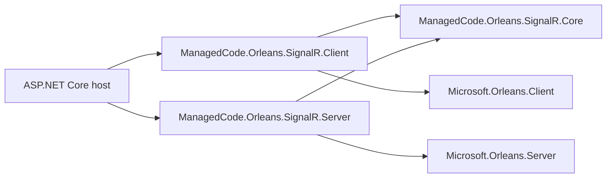
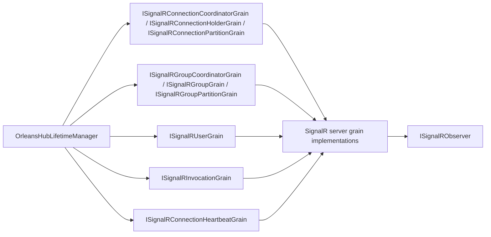
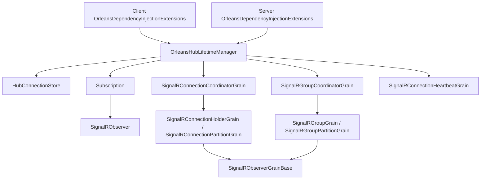

# Architecture Overview

## Scoping (read first)

**In scope**
- How the core, client, server, and test modules interact.
- Where the primary entry points live for SignalR hosts and Orleans grains.
- Dependency boundaries between modules.

**Out of scope**
- Detailed feature flows (see docs/Features/*).
- Architectural decisions and trade-offs (see docs/ADR/*).

**Entry points to start from**
- `ManagedCode.Orleans.SignalR.Core/SignalR/OrleansHubLifetimeManager.cs`
- `ManagedCode.Orleans.SignalR.Client/Extensions/OrleansHubGroupExtensions.cs`
- `ManagedCode.Orleans.SignalR.Server/SignalRConnectionCoordinatorGrain.cs`
- `ManagedCode.Orleans.SignalR.Server/SignalRGroupCoordinatorGrain.cs`
- `ManagedCode.Orleans.SignalR.Server/SignalRObserverGrainBase.cs`
- `ManagedCode.Orleans.SignalR.Client/Extensions/OrleansDependencyInjectionExtensions.cs`
- `ManagedCode.Orleans.SignalR.Tests/TestApp/HttpHostProgram.cs`

## System / module map

## Interfaces / contracts map

## Key classes / types map

## Module catalog (responsibilities + boundaries)

- ManagedCode.Orleans.SignalR.Core
  - Responsibilities: core abstractions, options, hub lifetime manager, hashing helpers, and shared interfaces.
  - Boundaries: must not depend on Client, Server, or Tests; keep ASP.NET Core hosting out of this module.
- ManagedCode.Orleans.SignalR.Client
  - Responsibilities: DI extensions for wiring SignalR and Orleans in ASP.NET Core hosts, plus hub-facing helpers that expose package-specific batch group operations.
  - Boundaries: depends only on Core; no Orleans grains or server-specific plumbing.
- ManagedCode.Orleans.SignalR.Server
  - Responsibilities: Orleans grains, persistence, routing coordinators, and server-side backplane mechanics.
  - Boundaries: depends on Core; does not depend on Client or Tests.
- ManagedCode.Orleans.SignalR.Tests
  - Responsibilities: integration and reliability tests, Orleans TestCluster setup, and minimal SignalR host.
  - Boundaries: test-only; must never be referenced by production projects.

## Dependency rules (allowed/forbidden)

**Allowed**
- Client -> Core
- Server -> Core
- Tests -> Core / Client / Server / TestApp / Cluster

**Forbidden**
- Core -> Client / Server / Tests
- Client -> Server
- Server -> Client
- Production projects -> Tests

## Link index (anchors for diagram elements)

- ASP.NET Core host: `ManagedCode.Orleans.SignalR.Tests/TestApp/HttpHostProgram.cs`
- ManagedCode.Orleans.SignalR.Client: `ManagedCode.Orleans.SignalR.Client/ManagedCode.Orleans.SignalR.Client.csproj`
- Client OrleansDependencyInjectionExtensions: `ManagedCode.Orleans.SignalR.Client/Extensions/OrleansDependencyInjectionExtensions.cs`
- Hub batch group extensions: `ManagedCode.Orleans.SignalR.Client/Extensions/OrleansHubGroupExtensions.cs`
- ManagedCode.Orleans.SignalR.Core: `ManagedCode.Orleans.SignalR.Core/ManagedCode.Orleans.SignalR.Core.csproj`
- OrleansHubLifetimeManager, HubConnectionStore: `ManagedCode.Orleans.SignalR.Core/SignalR/OrleansHubLifetimeManager.cs`
- Subscription, SignalRObserver: `ManagedCode.Orleans.SignalR.Core/SignalR/Observers/Subscription.cs`, `ManagedCode.Orleans.SignalR.Core/SignalR/Observers/SignalRObserver.cs`
- Grain and observer contracts: `ManagedCode.Orleans.SignalR.Core/Interfaces/`
- ManagedCode.Orleans.SignalR.Server: `ManagedCode.Orleans.SignalR.Server/ManagedCode.Orleans.SignalR.Server.csproj`
- Server OrleansDependencyInjectionExtensions: `ManagedCode.Orleans.SignalR.Server/Extensions/OrleansDependencyInjectionExtensions.cs`
- SignalR server grain implementations: `ManagedCode.Orleans.SignalR.Server/*Grain.cs`
- SignalRObserverGrainBase: `ManagedCode.Orleans.SignalR.Server/SignalRObserverGrainBase.cs`
- Connection coordinator and targets: `ManagedCode.Orleans.SignalR.Server/SignalRConnectionCoordinatorGrain.cs`, `ManagedCode.Orleans.SignalR.Server/SignalRConnectionHolderGrain.cs`, `ManagedCode.Orleans.SignalR.Server/SignalRConnectionPartitionGrain.cs`
- Group coordinator and targets: `ManagedCode.Orleans.SignalR.Server/SignalRGroupCoordinatorGrain.cs`, `ManagedCode.Orleans.SignalR.Server/SignalRGroupGrain.cs`, `ManagedCode.Orleans.SignalR.Server/SignalRGroupPartitionGrain.cs`
- Connection heartbeat: `ManagedCode.Orleans.SignalR.Server/SignalRConnectionHeartbeatGrain.cs`
- Microsoft.Orleans.Client / Microsoft.Orleans.Server: `Directory.Packages.props`
- SignalR metrics: `docs/Features/Diagnostics-Metrics.md`

## Key ADRs and feature specs

- ADRs
  - `docs/ADR/0001-architecture-docs-structure.md`
  - `docs/ADR/0002-orleans-hub-lifetime-manager.md`
  - `docs/ADR/0003-partitioned-routing-with-consistent-hashing.md`
  - `docs/ADR/0004-observer-health-circuit-breaker.md`
  - `docs/ADR/0005-connection-heartbeat-keepalive.md`
  - `docs/ADR/0006-persistent-state-and-storage-provider.md`
  - `docs/ADR/0007-invocation-grain-for-client-invocations.md`
  - `docs/ADR/0008-typed-orleans-hub-context.md`
  - `docs/ADR/0009-user-fanout-and-offline-buffering.md`
- Features
  - `docs/Features/Connection-Partitioning.md`
  - `docs/Features/Group-Partitioning.md`
  - `docs/Features/Diagnostics-Metrics.md`
  - `docs/Features/Hub-Lifetime-Manager-Integration.md`
  - `docs/Features/Observer-Health-and-Circuit-Breaker.md`
  - `docs/Features/Connection-Heartbeat.md`
  - `docs/Features/State-Persistence.md`
  - `docs/Features/Invocation-Routing.md`
  - `docs/Features/Typed-Hub-Context.md`
  - `docs/Features/User-Fanout-and-Offline-Buffering.md`
