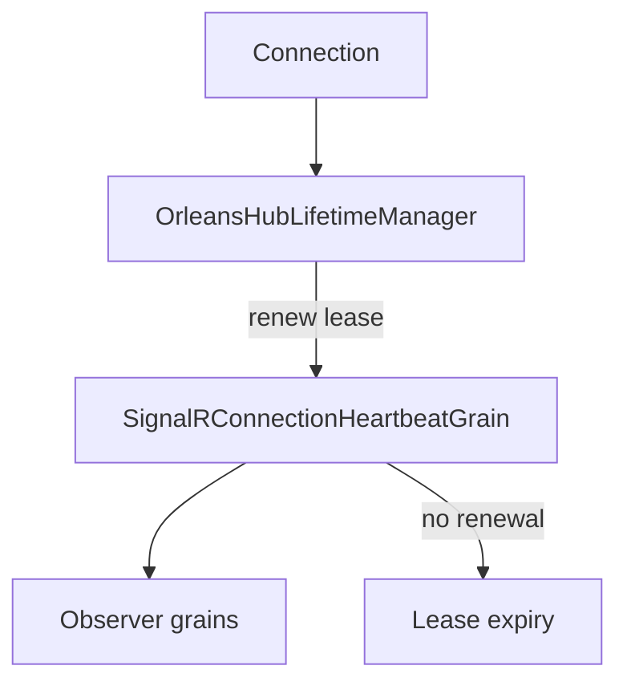

# Feature: Connection heartbeat keep-alive

## Summary

When keep-alive is enabled, each connection is associated with a heartbeat grain that refreshes observer subscriptions. This keeps idle connections from expiring due to inactivity.

## Scope

**In scope**
- Heartbeat registration and periodic observer refresh.
- Persistent registration and activation-collection behavior.

**Out of scope**
- Observer health and circuit breaker logic.
- Partitioning decisions.

## Implementation plan (step-by-step)

- [x] Renew a bounded lease while each local connection remains registered.
- [x] Expire the lease and clean target routing state when renewal stops.
- [x] Keep one connection's renewal failure from stopping renewals for other connections.
- [x] Expose every renewal failure through a counter and rate-limit warning logs.
- [x] Retry persistence for an unchanged registration when the previous storage write failed.
- [x] Prove the retry with a deterministic fail-first storage test.
- [x] Verify the full regression and coverage suites (109/109 tests; 70.77% line and 61.65% branch coverage); focused lease renewal, expiry, cleanup, metrics, HA, and load checks are complete.

## Main flow

## Behavior notes

- Heartbeats are enabled by `OrleansSignalROptions.KeepEachConnectionAlive`.
- The heartbeat grain re-adds the observer to all grains tracked by the subscription.
- The manager renews the lease while the connection remains locally registered.
- A failed renewal does not abort the manager-wide renewal loop: the individual lease remains unextended, a failure counter is emitted, warning logs are rate-limited, and a later tick retries it.
- The timer keeps its activation alive only while that bounded lease remains valid; the durable design is defined by [ADR-0005](../ADR/0005-connection-heartbeat-keepalive.md).
- Missing disconnect cleanup is bounded while the heartbeat's silo remains alive: after twice the effective client-timeout interval, an unrenewed heartbeat removes the connection from its target grains and partition coordinator, clears its state, and deactivates.
- A grain timer is not a durable reminder. Simultaneous loss of the connection host and the heartbeat silo leaves no live activation or timer, but persisted routing state needs a later heartbeat activation (or a separately designed durable sweeper) to self-heal.

## Configuration knobs

- `OrleansSignalROptions.KeepEachConnectionAlive`
- `OrleansSignalROptions.ClientTimeoutInterval`
- `HubOptions.ClientTimeoutInterval`

## Key types and files

- `ManagedCode.Orleans.SignalR.Server/SignalRConnectionHeartbeatGrain.cs`
- `ManagedCode.Orleans.SignalR.Core/SignalR/OrleansHubLifetimeManager.cs`
- `ManagedCode.Orleans.SignalR.Core/Helpers/TimeIntervalHelper.cs`
