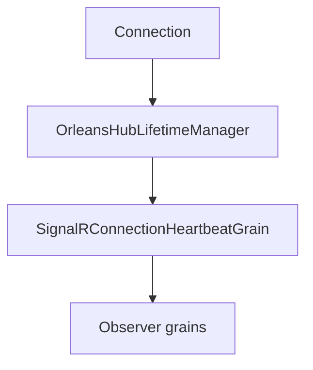

# Feature: Connection heartbeat keep-alive

## Summary

When keep-alive is enabled, each connection is associated with a heartbeat grain that refreshes observer subscriptions. This keeps idle connections from expiring due to inactivity.

## Scope

**In scope**
- Heartbeat registration and periodic pinging.
- Persistent registration to survive grain reactivation.

**Out of scope**
- Observer health and circuit breaker logic.
- Partitioning decisions.

## Main flow

## Behavior notes

- Heartbeats are enabled by `OrleansSignalROptions.KeepEachConnectionAlive`.
- The heartbeat grain pings all grains tracked by the subscription to refresh observers.

## Configuration knobs

- `OrleansSignalROptions.KeepEachConnectionAlive`
- `OrleansSignalROptions.ClientTimeoutInterval`
- `HubOptions.ClientTimeoutInterval`

## Key types and files

- `ManagedCode.Orleans.SignalR.Server/SignalRConnectionHeartbeatGrain.cs`
- `ManagedCode.Orleans.SignalR.Core/SignalR/OrleansHubLifetimeManager.cs`
- `ManagedCode.Orleans.SignalR.Core/Helpers/TimeIntervalHelper.cs`
