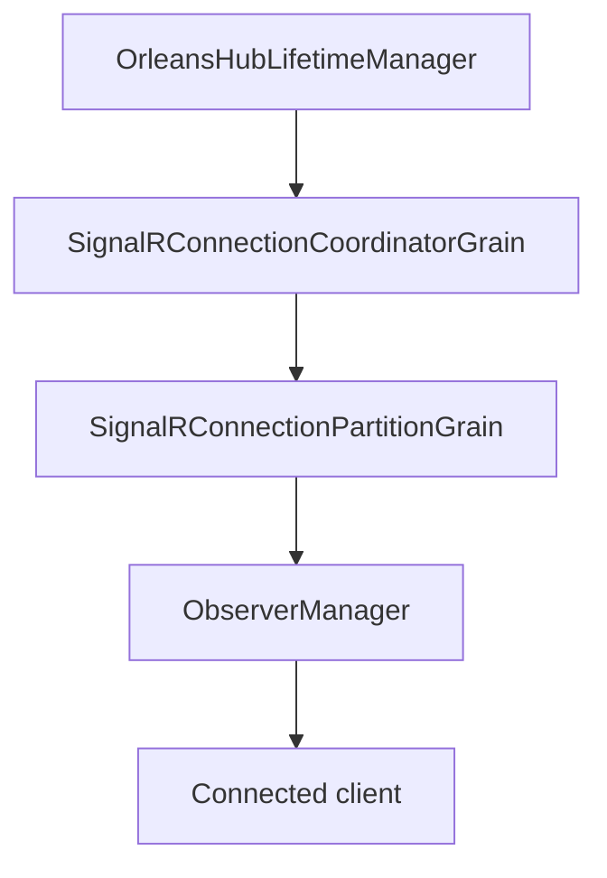

# Feature: Connection Partitioning and Fan-out

## Summary

Orleans.SignalR routes SignalR connection traffic through Orleans grains so hubs can scale out across silos. Connections are assigned to partitions via consistent hashing, and fan-out is handled by partition grains that track observers for connected clients.

## Scope

**In scope**
- Partition assignment and routing for connection-based operations.
- Fan-out from partitions to connected clients.
- Dynamic resizing based on connection count hints.

**Out of scope**
- Group partitioning and group membership flows.
- User-specific fan-out and invocation routing.

## Implementation plan (step-by-step)

- [x] Keep existing connection-to-partition assignments stable when partition count scales.
- [x] Preserve broadcast fan-out even when no active partitions are tracked.
- [x] Add tests that assert stable assignments across scaling.

## Main flow

## Behavior notes

- Connections are mapped to partitions using consistent hashing, so existing assignments stay stable when the partition count grows.
- Coordinators track connection counts and scale the partition ring to the next power of two when hints are exceeded.
- Partitions maintain observer subscriptions and broadcast HubMessage payloads to matching connections.
- Broadcast fan-out falls back to the current partition count when no active partitions are tracked (e.g., after a restart).

## Configuration knobs

- `OrleansSignalROptions.ConnectionPartitionCount`
- `OrleansSignalROptions.ConnectionsPerPartitionHint`
- `OrleansSignalROptions.KeepEachConnectionAlive`
- `OrleansSignalROptions.ClientTimeoutInterval`

## Key types and files

- `ManagedCode.Orleans.SignalR.Core/SignalR/OrleansHubLifetimeManager.cs`
- `ManagedCode.Orleans.SignalR.Server/SignalRConnectionCoordinatorGrain.cs`
- `ManagedCode.Orleans.SignalR.Server/SignalRConnectionPartitionGrain.cs`
- `ManagedCode.Orleans.SignalR.Core/Helpers/PartitionHelper.cs`
- `ManagedCode.Orleans.SignalR.Core/Config/OrleansSignalROptions.cs`
