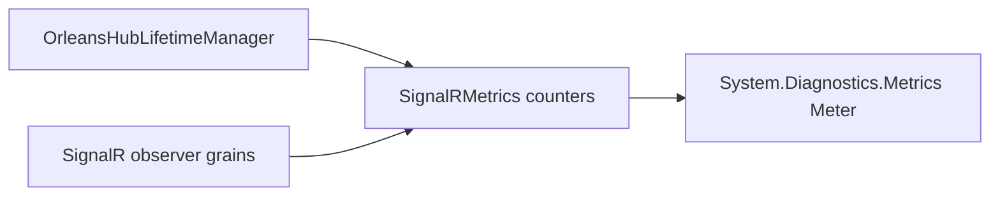

# Feature: Diagnostics metrics

## Summary

Expose lightweight counters for key SignalR/Orleans backplane behaviors via `System.Diagnostics.Metrics`.

## Scope

**In scope**
- Connection, message, observer health, and heartbeat-renewal counters.
- Metrics wiring in hub lifetime manager and observer grains.

**Out of scope**
- Distributed tracing and activity sources.
- Per-hub observable gauges and advanced aggregation.

## Implementation plan (step-by-step)

- [x] Define a shared metrics surface using `SignalRMetrics`.
- [x] Wire metrics in hub lifetime manager and observer grains.
- [x] Add tests that assert counter emissions.

## Main flow

## Behavior notes

- Metrics are counters and up/down counters only.
- Metrics are emitted via a shared singleton instance.
- `signalr.heartbeat.renewal.failures.total` records every failed lease-renewal attempt without using connection IDs as metric tags.

## Key types and files

- `ManagedCode.Orleans.SignalR.Core/Diagnostics/SignalRMetrics.cs`
- `ManagedCode.Orleans.SignalR.Core/SignalR/OrleansHubLifetimeManager.cs`
- `ManagedCode.Orleans.SignalR.Server/SignalRObserverGrainBase.cs`
