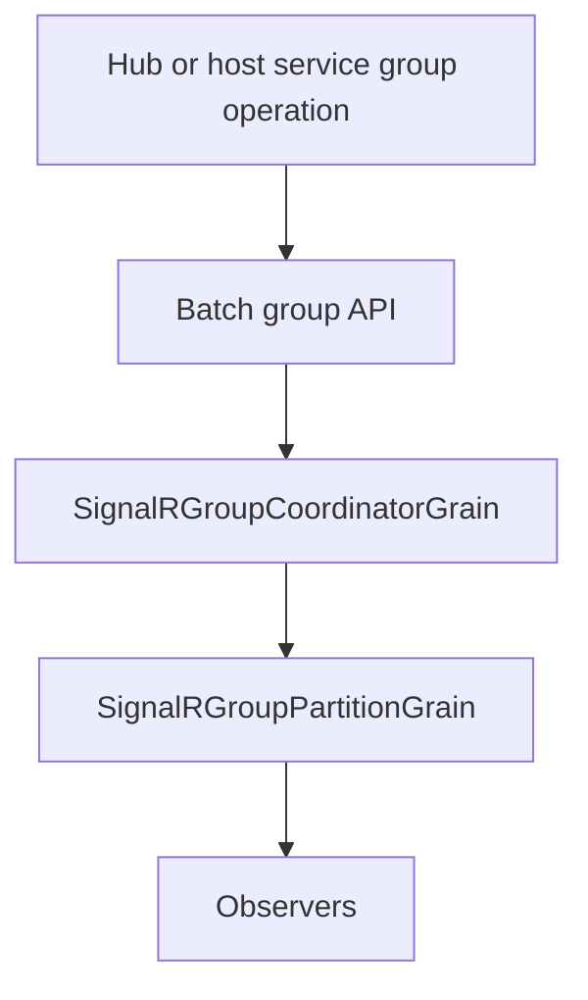

# Feature: Group partitioning and membership

## Summary

Group operations are routed through a coordinator grain that assigns group names to partitions using consistent hashing. Partition grains maintain group membership and fan-out messages to observers. Batch membership APIs can add or remove one connection across many groups with a single coordinator persistence step.

## Scope

**In scope**
- Group partition assignment and routing.
- Membership tracking and cleanup when groups become empty.
- Batch add/remove operations for one connection across multiple groups.

**Out of scope**
- Connection partitioning and routing.
- Observer health/circuit breaker behavior.
- Changes to SignalR's built-in `IGroupManager` contract.

## Implementation plan (step-by-step)

- [x] Keep existing group-to-partition assignments stable when partition count scales.
- [x] Add tests that assert stable assignments across scaling.
- [x] Add package-level batch group APIs for hub and host-service callers.
- [x] Batch coordinator and partition updates so one request does not force sequential writes per group.
- [x] Cover batch add/remove with integration tests and direct coordinator verification.

## Main flow

## Behavior notes

- Group names are mapped to partitions via the coordinator, which persists assignments and tracks partition-count epochs.
- Existing group assignments stay stable when the partition count grows.
- Partition grains hold `group -> connection -> observer` mappings and emit fan-out to observers.
- Empty groups trigger cleanup so partitions can shed state.
- Batch membership operations collapse repeated coordinator writes into one persistence step per request and one partition write per touched partition.

## Configuration knobs

- `OrleansSignalROptions.GroupPartitionCount`
- `OrleansSignalROptions.GroupsPerPartitionHint`

## Key types and files

- `ManagedCode.Orleans.SignalR.Server/SignalRGroupCoordinatorGrain.cs`
- `ManagedCode.Orleans.SignalR.Server/SignalRGroupPartitionGrain.cs`
- `ManagedCode.Orleans.SignalR.Core/HubContext/IOrleansGroupManager.cs`
- `ManagedCode.Orleans.SignalR.Core/HubContext/OrleansGroupManager.cs`
- `ManagedCode.Orleans.SignalR.Client/Extensions/OrleansHubGroupExtensions.cs`
- `ManagedCode.Orleans.SignalR.Core/Helpers/PartitionHelper.cs`
- `ManagedCode.Orleans.SignalR.Core/Models/GroupCoordinatorState.cs`
