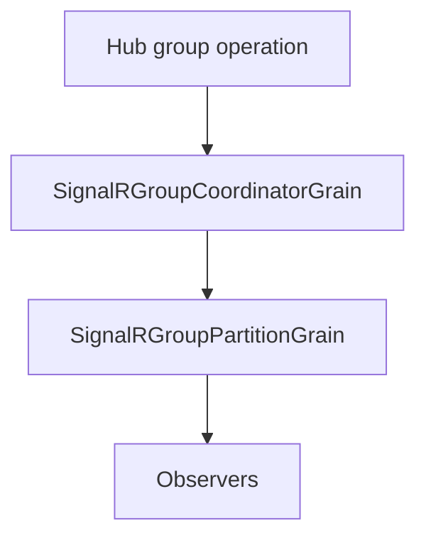

# Feature: Group partitioning and membership

## Summary

Group operations are routed through a coordinator grain that assigns group names to partitions using consistent hashing. Partition grains maintain group membership and fan-out messages to observers.

## Scope

**In scope**
- Group partition assignment and routing.
- Membership tracking and cleanup when groups become empty.

**Out of scope**
- Connection partitioning and routing.
- Observer health/circuit breaker behavior.

## Implementation plan (step-by-step)

- [x] Keep existing group-to-partition assignments stable when partition count scales.
- [x] Add tests that assert stable assignments across scaling.

## Main flow

## Behavior notes

- Group names are mapped to partitions via the coordinator, which persists assignments and tracks partition-count epochs.
- Existing group assignments stay stable when the partition count grows.
- Partition grains hold `group -> connection -> observer` mappings and emit fan-out to observers.
- Empty groups trigger cleanup so partitions can shed state.

## Configuration knobs

- `OrleansSignalROptions.GroupPartitionCount`
- `OrleansSignalROptions.GroupsPerPartitionHint`

## Key types and files

- `ManagedCode.Orleans.SignalR.Server/SignalRGroupCoordinatorGrain.cs`
- `ManagedCode.Orleans.SignalR.Server/SignalRGroupPartitionGrain.cs`
- `ManagedCode.Orleans.SignalR.Core/Helpers/PartitionHelper.cs`
- `ManagedCode.Orleans.SignalR.Core/Models/GroupCoordinatorState.cs`
