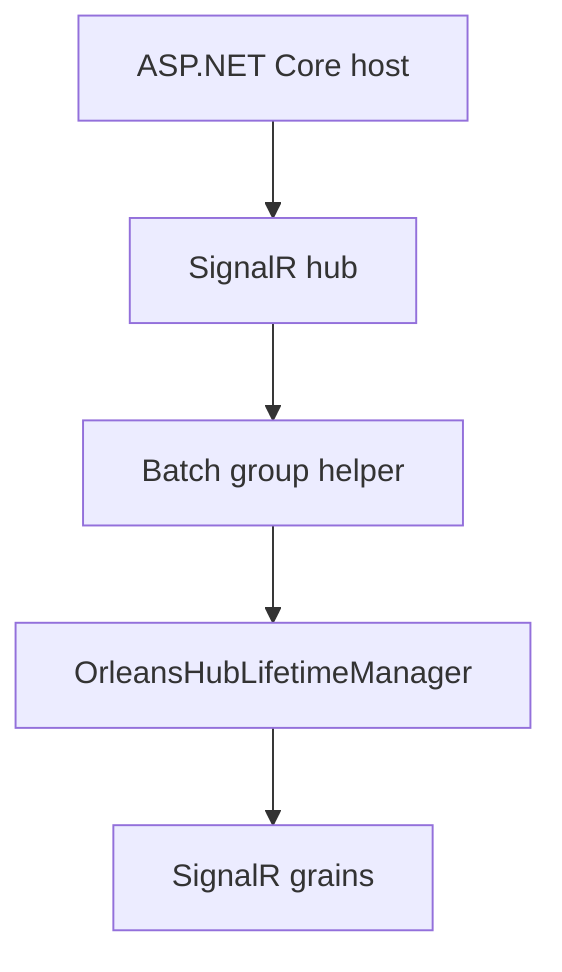

# Feature: Hub lifetime manager integration

## Summary

The ASP.NET Core host swaps the default SignalR hub lifetime manager with `OrleansHubLifetimeManager<THub>` so all hub operations route through Orleans grains.

## Scope

**In scope**
- Hub lifetime manager registration via DI (`AddOrleans`).
- Connection lifecycle and message routing through Orleans grains.
- Long-lived connection registration, observer refresh, reconnect, shutdown, and stale-state cleanup.
- Concurrency and hot-path performance across connection, group, user, invocation, and heartbeat grains.
- Updating existing NuGet dependencies to current compatible stable releases.
- Repository-wide compiler, .NET SDK, and Roslynator static-analysis gates.

**Out of scope**
- Partitioning strategy details (see Connection/Group partitioning docs).
- Public method signature changes and storage schema changes.
- Typed hub-context behavior unrelated to connection reliability.

## Implementation plan (step-by-step)

- [x] Update all existing NuGet dependencies to compatible stable versions and resolve vulnerable transitive dependencies without suppressing audit warnings.
- [x] Add failing regression tests for every confirmed long-lived connection, concurrency, cleanup, or routing defect.
- [x] Apply the smallest behavior-preserving fixes, keeping SignalR observer I/O off the Orleans scheduler.
- [x] Run coverage (109/109 tests; 70.77% line and 61.65% branch coverage), the full test suite (109/109), format, and a final build; changed, reliability, HA, and performance suites are complete.
- [x] Restore fire-and-forget fan-out for multi-group and multi-user sends.
- [x] Ensure per-target send failures are logged without blocking hub execution.
- [x] Route package-specific batch group membership calls through the Orleans lifetime manager.
- [x] Keep batch group helper calls usable when the host is running plain `AddSignalR()`.
- [x] Add regression coverage for the batch helper path without Orleans registration.
- [x] Re-run batch partition cleanup after disconnect when a late coordinator write finishes.
- [x] Carry server-to-client invocation return types to the connection host in a reserved internal invocation header so SignalR's synchronous lookup never blocks on an Orleans request.
- [x] Acknowledge required invocation completions while preserving one-way observer fan-out and keeping SignalR work off the Orleans scheduler.
- [x] Measure server-to-client invocation throughput against the unchanged baseline.
- [x] Remove the per-broadcast wait on the offloaded one-way observer enqueue loop.
- [x] Repair the benchmark's polling quantization and compare repeated before/after Broadcast runs.
- [x] Verify Broadcast, group, streaming, and invocation load after the reliability changes.

## Main flow

## Behavior notes

- `AddOrleans()` registers `OrleansHubLifetimeManager<THub>` as the `HubLifetimeManager` implementation.
- The lifetime manager creates a per-connection `Subscription` and registers observers with connection/group/user grains.
- Package-specific batch group operations (`AddToGroupsAsync` / `RemoveFromGroupsAsync`) also route through the lifetime manager instead of looping over sequential single-group writes.
- Hub batch helpers fall back to the registered `HubLifetimeManager<THub>` when `IOrleansGroupManager<THub>` is not explicitly registered, so the API still works on plain `AddSignalR()` hosts.
- If a partitioned batch join finishes after the connection has already disconnected, the lifetime manager immediately routes a compensating batch remove through the coordinator before returning.
- Cross-host server-to-client invocation return types travel in a reserved header on the Orleans-routed invocation. The connection host removes that header and caches the type before writing the invocation to SignalR; the synchronous `TryGetReturnType` hook performs only an in-memory lookup.
- Fan-out observer sends remain one-way and run outside the Orleans scheduler. Broadcast/group paths use one bounded offloaded worker per fan-out instead of one `Task.Run` per observer; single-connection routing stays fire-and-forget. `TryCompleteResult` is acknowledged because losing a required completion leaves `InvokeConnectionAsync<T>` permanently waiting.
- In the 20-pair cross-host load scenario, the unchanged baseline completed 0/60 calls before the 30-second deadline. The final fire-and-forget path completed 60/60 in 52 ms and 72 ms in two independent runs (1,154 and 831 calls/s).
- The final comparison runs delivered 20,000/20,000 broadcast messages at 69,529 deliveries/s, 12,000/12,000 group messages at 43,871 deliveries/s, and 16,800/16,800 invocations at 683 calls/s. Orleans-to-in-memory elapsed-time ratios were 1.04x, 1.03x, and 1.00x respectively.
- Detailed batching behavior and partition persistence rules live in `docs/Features/Group-Partitioning.md`.

## Configuration knobs

- `OrleansSignalROptions` (registered by the client extension)
- `HubOptions` and `HubOptions<THub>` (SignalR host configuration)

## Key types and files

- `ManagedCode.Orleans.SignalR.Client/Extensions/OrleansDependencyInjectionExtensions.cs`
- `ManagedCode.Orleans.SignalR.Client/Extensions/OrleansHubGroupExtensions.cs`
- `ManagedCode.Orleans.SignalR.Core/HubContext/IOrleansGroupManager.cs`
- `ManagedCode.Orleans.SignalR.Core/SignalR/OrleansHubLifetimeManager.cs`
- `ManagedCode.Orleans.SignalR.Core/SignalR/Observers/Subscription.cs`
