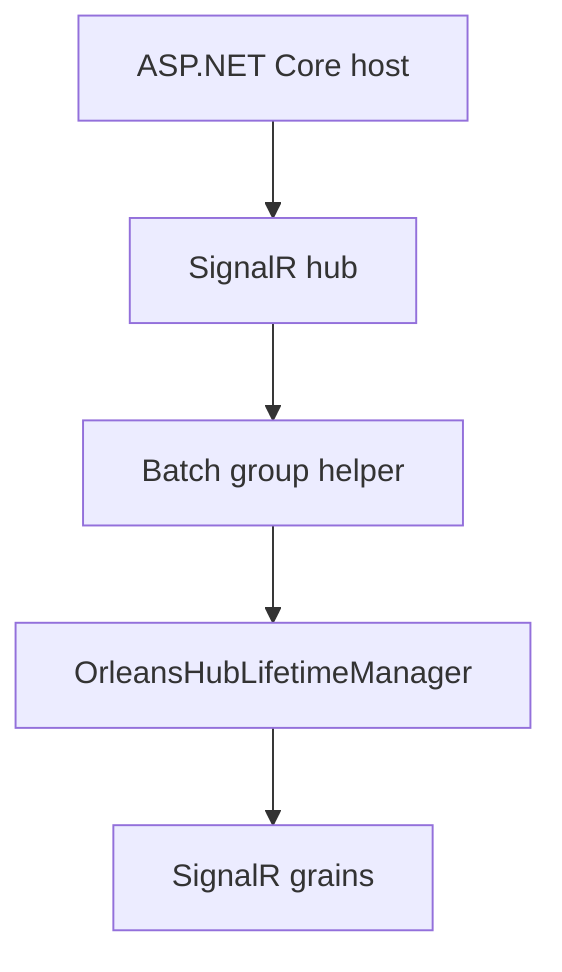

# Feature: Hub lifetime manager integration

## Summary

The ASP.NET Core host swaps the default SignalR hub lifetime manager with `OrleansHubLifetimeManager<THub>` so all hub operations route through Orleans grains.

## Scope

**In scope**
- Hub lifetime manager registration via DI (`AddOrleans`).
- Connection lifecycle and message routing through Orleans grains.

**Out of scope**
- Partitioning strategy details (see Connection/Group partitioning docs).
- Observer health and circuit breaker behavior.

## Implementation plan (step-by-step)

- [x] Restore fire-and-forget fan-out for multi-group and multi-user sends.
- [x] Ensure per-target send failures are logged without blocking hub execution.
- [x] Route package-specific batch group membership calls through the Orleans lifetime manager.

## Main flow

## Behavior notes

- `AddOrleans()` registers `OrleansHubLifetimeManager<THub>` as the `HubLifetimeManager` implementation.
- The lifetime manager creates a per-connection `Subscription` and registers observers with connection/group/user grains.
- Package-specific batch group operations (`AddToGroupsAsync` / `RemoveFromGroupsAsync`) also route through the lifetime manager instead of looping over sequential single-group writes.
- Detailed batching behavior and partition persistence rules live in `docs/Features/Group-Partitioning.md`.

## Configuration knobs

- `OrleansSignalROptions` (registered by the client extension)
- `HubOptions` and `HubOptions<THub>` (SignalR host configuration)

## Key types and files

- `ManagedCode.Orleans.SignalR.Client/Extensions/OrleansDependencyInjectionExtensions.cs`
- `ManagedCode.Orleans.SignalR.Client/Extensions/OrleansHubGroupExtensions.cs`
- `ManagedCode.Orleans.SignalR.Core/HubContext/IOrleansGroupManager.cs`
- `ManagedCode.Orleans.SignalR.Core/SignalR/OrleansHubLifetimeManager.cs`
- `ManagedCode.Orleans.SignalR.Core/SignalR/Observers/Subscription.cs`
