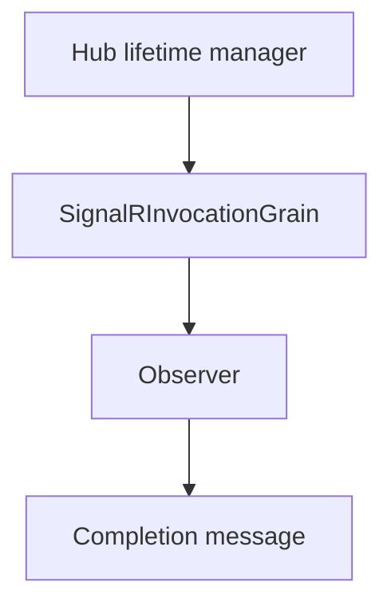

# Feature: Client invocation routing

## Summary

Client invocations are routed through a dedicated `SignalRInvocationGrain` that tracks invocation state and completion messages.

## Scope

**In scope**
- Invocation state tracking and completion delivery.
- Observer subscription for invocation completion.

**Out of scope**
- Connection and group routing.
- Observer health and circuit breaker behavior.

## Implementation plan (step-by-step)

- [x] Remove synchronous Orleans waits from SignalR's `TryGetReturnType` hook.
- [x] Carry the expected return type to the connection host and cache it before writing the invocation.
- [x] Acknowledge the required completion-grain call without moving SignalR I/O onto the Orleans scheduler.
- [x] Prove cross-host completion under concurrent load against an unchanged baseline.

## Main flow

## Behavior notes

- Each invocation is keyed by hub and invocation ID.
- The invocation grain stores state and completes a `TaskCompletionSource` when it receives a completion message.
- Cross-host invocation messages include a reserved internal return-type header. The target host removes it and registers the type locally before SignalR performs its synchronous return-type lookup.
- `TryCompleteResult` is an acknowledged grain call because its delivery is required to unblock the originating request. Observer fan-out remains one-way, and SignalR writes/notifications remain off the Orleans scheduler.

## Configuration knobs

- `OrleansSignalROptions.ClientTimeoutInterval`
- `HubOptions.ClientTimeoutInterval`

## Key types and files

- `ManagedCode.Orleans.SignalR.Server/SignalRInvocationGrain.cs`
- `ManagedCode.Orleans.SignalR.Core/Interfaces/ISignalRInvocationGrain.cs`
- `ManagedCode.Orleans.SignalR.Core/Models/InvocationInfo.cs`
