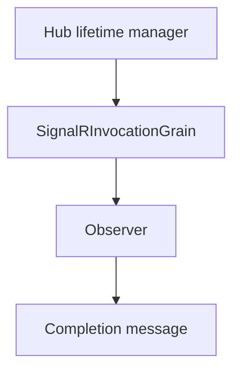

# Feature: Client invocation routing

## Summary

Client invocations are routed through a dedicated `SignalRInvocationGrain` that tracks invocation state and completion messages.

## Scope

**In scope**
- Invocation state tracking and completion delivery.
- Observer subscription for invocation completion.

**Out of scope**
- Connection and group routing.
- Observer health and circuit breaker behavior.

## Main flow

## Behavior notes

- Each invocation is keyed by hub and invocation ID.
- The invocation grain stores state and completes a `TaskCompletionSource` when it receives a completion message.

## Configuration knobs

- `OrleansSignalROptions.ClientTimeoutInterval`
- `HubOptions.ClientTimeoutInterval`

## Key types and files

- `ManagedCode.Orleans.SignalR.Server/SignalRInvocationGrain.cs`
- `ManagedCode.Orleans.SignalR.Core/Interfaces/ISignalRInvocationGrain.cs`
- `ManagedCode.Orleans.SignalR.Core/Models/InvocationInfo.cs`
