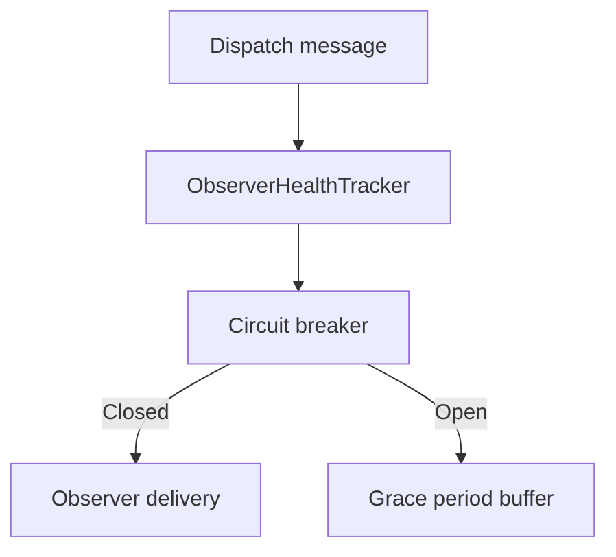

# Feature: Observer health and circuit breaker

## Summary

Observer delivery is protected by health tracking, circuit breaker logic, and optional grace period buffering. This prevents repeated delivery failures from cascading across fan-out operations.

## Scope

**In scope**
- Failure tracking and circuit breaker state per connection.
- Optional grace period buffering and replay.

**Out of scope**
- Partitioning strategy and routing.
- User message buffering.

## Implementation plan (step-by-step)

- [x] Clarify failure-threshold semantics so circuit-breaker and dead removal do not conflict.
- [x] Route grace-period expiration to observer cleanup and health-state removal.
- [x] Offload observer notifications from the Orleans scheduler and document why it is critical.
- [x] Add tests for circuit-breaker threshold behavior (enabled vs disabled).
- [x] Keep grace-period state transitions on the Orleans scheduler and offload only observer replay I/O.

## Main flow

## Behavior notes

- Failed deliveries are recorded in a rolling failure window.
- When thresholds are exceeded, the circuit opens and delivery is skipped.
- If a grace period is configured, messages are buffered and replayed on recovery; expired grace periods remove observers.
- Grace-period recovery mutates `ObserverHealthTracker` on the grain scheduler first, then replays buffered observer callbacks off-scheduler so Orleans-owned state is never touched from a thread-pool turn.
- Without a grace period, reaching the failure threshold removes the observer immediately.
- Observer callbacks are intentionally one-way. Therefore, the grain-side health tracker can observe local enqueue/transport-dispatch failures, but it cannot observe an exception thrown later by the remote host's SignalR `WriteAsync`. Reacting to remote write failures requires an explicit feedback protocol; treating one-way completion as a delivery acknowledgement would be incorrect.

## Configuration knobs

- `OrleansSignalROptions.ObserverFailureThreshold`
- `OrleansSignalROptions.ObserverFailureWindow`
- `OrleansSignalROptions.EnableCircuitBreaker`
- `OrleansSignalROptions.CircuitBreakerOpenDuration`
- `OrleansSignalROptions.CircuitBreakerHalfOpenTestInterval`
- `OrleansSignalROptions.ObserverGracePeriod`
- `OrleansSignalROptions.MaxBufferedMessagesPerObserver`

## Key types and files

- `ManagedCode.Orleans.SignalR.Core/SignalR/Observers/ObserverHealthTracker.cs`
- `ManagedCode.Orleans.SignalR.Core/SignalR/Observers/ExpiringObserverBuffer.cs`
- `ManagedCode.Orleans.SignalR.Server/SignalRObserverGrainBase.cs`
