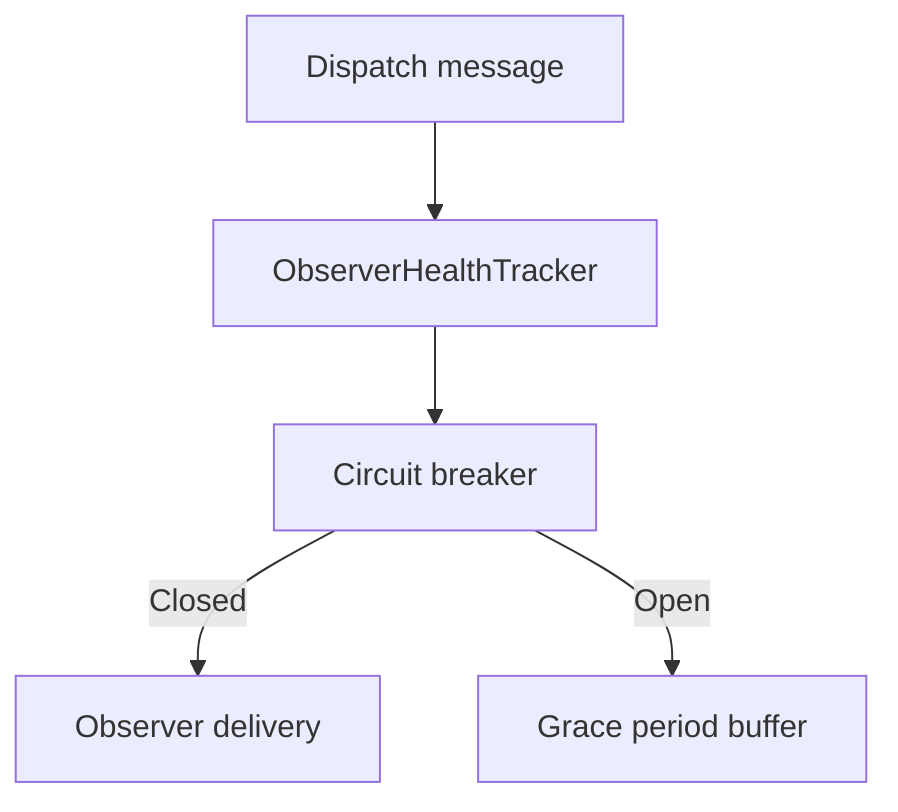

# Feature: Observer health and circuit breaker

## Summary

Observer delivery is protected by health tracking, circuit breaker logic, and optional grace period buffering. This prevents repeated delivery failures from cascading across fan-out operations.

## Scope

**In scope**
- Failure tracking and circuit breaker state per connection.
- Optional grace period buffering and replay.

**Out of scope**
- Partitioning strategy and routing.
- User message buffering.

## Main flow

## Behavior notes

- Failed deliveries are recorded in a rolling failure window.
- When thresholds are exceeded, the circuit opens and delivery is skipped.
- If a grace period is configured, messages are buffered and replayed on recovery.

## Configuration knobs

- `OrleansSignalROptions.ObserverFailureThreshold`
- `OrleansSignalROptions.ObserverFailureWindow`
- `OrleansSignalROptions.EnableCircuitBreaker`
- `OrleansSignalROptions.CircuitBreakerOpenDuration`
- `OrleansSignalROptions.CircuitBreakerHalfOpenTestInterval`
- `OrleansSignalROptions.ObserverGracePeriod`
- `OrleansSignalROptions.MaxBufferedMessagesPerObserver`

## Key types and files

- `ManagedCode.Orleans.SignalR.Core/SignalR/Observers/ObserverHealthTracker.cs`
- `ManagedCode.Orleans.SignalR.Core/SignalR/Observers/ExpiringObserverBuffer.cs`
- `ManagedCode.Orleans.SignalR.Server/SignalRObserverGrainBase.cs`
