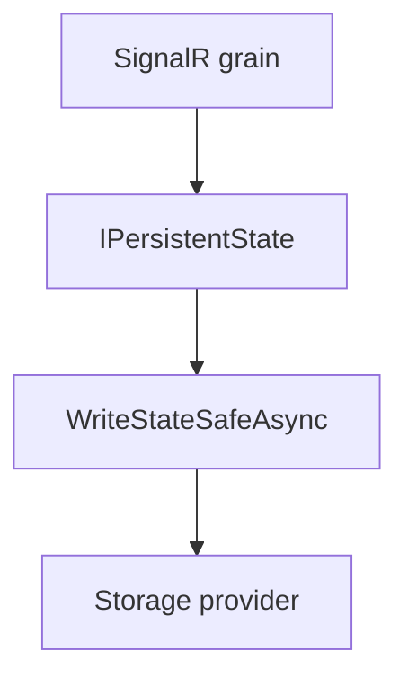

# Feature: State persistence and safe writes

## Summary

SignalR grains persist routing state and queued messages using a shared storage provider name and safe write helpers that retry on ETag conflicts.

## Scope

**In scope**
- Persistence for connection, group, user, and invocation grains.
- Safe write/clear helpers to handle ETag conflicts.

**Out of scope**
- Selection of specific Orleans storage providers.
- Partitioning strategy details.

## Implementation plan (step-by-step)

- [x] Serialize persistent-state writes within reentrant grains to avoid ETag conflicts.
- [x] Apply serialization to all grains that call `WriteStateSafeAsync`/`ClearStateSafeAsync`.
- [ ] Re-run routing and high-availability tests to confirm timeouts are resolved.

## Main flow

## Behavior notes

- All SignalR grains use `OrleansSignalROptions.OrleansSignalRStorage` as the storage provider name.
- Reentrant grains serialize `WriteStateSafeAsync`/`ClearStateSafeAsync` calls with `StateWriteLock` to prevent concurrent ETag conflicts.
- Safe write helpers retry on `InconsistentStateException` and memory storage ETag mismatch errors.

## Configuration knobs

- `OrleansSignalROptions.OrleansSignalRStorage`

## Key types and files

- `ManagedCode.Orleans.SignalR.Server/Helpers/PersistentStateExtensions.cs`
- `ManagedCode.Orleans.SignalR.Server/Helpers/StateWriteLock.cs`
- `ManagedCode.Orleans.SignalR.Core/Config/OrleansSignalROptions.cs`
