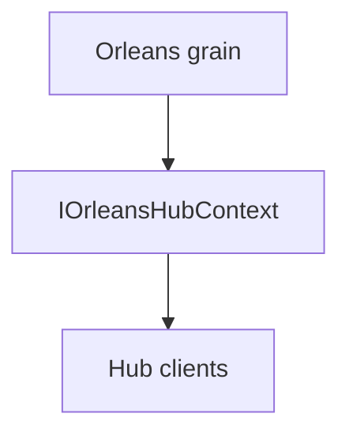

# Feature: Typed Orleans hub context

## Summary

Grains can use a typed hub context to call SignalR clients and manage groups without losing compile-time safety.

## Scope

**In scope**
- Typed client and group access from grains.
- Hub context abstraction over SignalR primitives.

**Out of scope**
- Lifetime manager routing details.
- Partitioning and observer health behavior.

## Main flow

## Behavior notes

- The hub context exposes `IHubClients<TClient>` and `IGroupManager` for typed usage.
- Under the hood, routing still flows through the Orleans-backed lifetime manager.

## Configuration knobs

- None (DI registration provided by the core integration)

## Key types and files

- `ManagedCode.Orleans.SignalR.Core/HubContext/IOrleansHubContext.cs`
- `ManagedCode.Orleans.SignalR.Core/HubContext/OrleansHubContext.cs`
- `ManagedCode.Orleans.SignalR.Core/HubContext/OrleansHubClients.cs`
