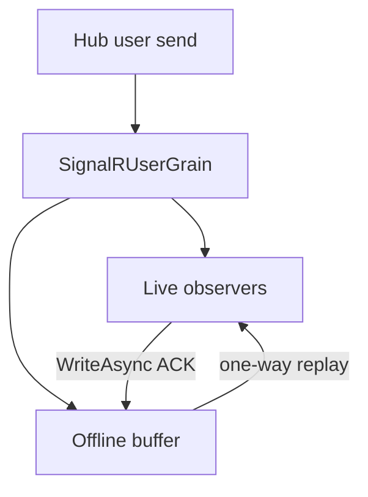

# Feature: User fan-out and offline buffering

## Summary

User-targeted messages are routed through a user grain that tracks all active connections and optionally buffers messages when the user is offline.

## Scope

**In scope**
- User connection tracking and fan-out.
- Offline message buffering and replay.
- Durable at-least-once acknowledgement for offline replay.

**Out of scope**
- Group and connection partitioning.
- Observer health and circuit breaker behavior.

## Main flow

## Implementation plan (step-by-step)

- [x] Persist an idempotent queue entry before acknowledging an offline send.
- [x] Retain replayed entries until the connection host acknowledges a successful SignalR write.
- [x] Replace the legacy dictionary with the single acknowledged queue schema for the new major version.
- [x] Cover enqueue crash retention, replay acknowledgement, no replay after durable acknowledgement, expiry, and queue bounds.

## Behavior notes

- When live observers exist, messages are delivered immediately.
- When no observers exist, messages are queued with expiration and a maximum size; oldest messages are dropped if limits are exceeded.
- On reconnect, the user grain replays buffered messages via `RequestMessage` and removes each entry only after a host-side SignalR write acknowledgement. Delivery is at least once.

## Configuration knobs

- `OrleansSignalROptions.KeepMessageInterval`
- `OrleansSignalROptions.MaxQueuedMessagesPerUser`

## Key types and files

- `ManagedCode.Orleans.SignalR.Server/SignalRUserGrain.cs`
- `ManagedCode.Orleans.SignalR.Core/Models/HubMessageState.cs`
- `ManagedCode.Orleans.SignalR.Core/Config/OrleansSignalROptions.cs`
