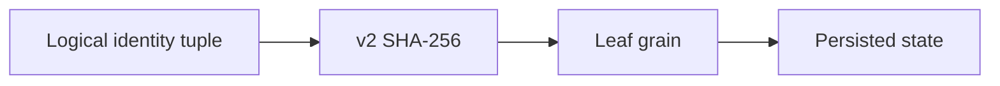

# Feature: Versioned grain keys

## Summary

Caller-controlled identity components use a versioned, collision-resistant key envelope instead of lossy character replacement.

## Scope

**In scope**
- User, group, invocation, and connection-heartbeat grain identities.
- One clean v2 key contract for the new major library version.

**Out of scope**
- Connection/group partition assignment hashes.
- Renaming Orleans grain types or hub-only coordinator identities.

## Main flow

## Implementation plan (step-by-step)

- [x] Encode length-delimited UTF-8 identity tuples into a fixed v2 hash key.
- [x] Use the same v2 contract for user, group, invocation, and heartbeat leaf grains.
- [x] Keep old key and state compatibility out of the new major version.
- [x] Test collision pairs, Unicode, tuple boundaries, determinism, null identity, and bounded length.

## Behavior notes

- `a/b`, `a?b`, and `a:b` map to different v2 leaf grains.
- The version prefix allows a later encoding change without another ambiguous cutover.
- Old leaf keys are intentionally not consulted.

## Key types and files

- `ManagedCode.Orleans.SignalR.Core/SignalR/NameHelperGenerator.cs`
- `ManagedCode.Orleans.SignalR.Core/Models/`
- `docs/ADR/0010-versioned-grain-key-encoding.md`
